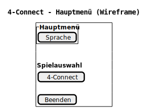
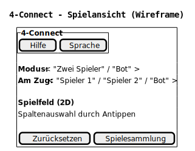
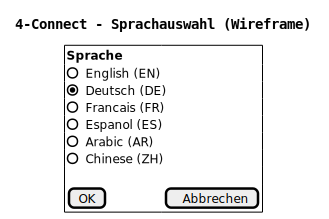
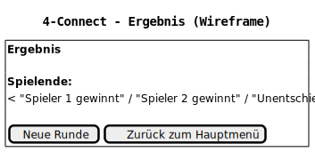
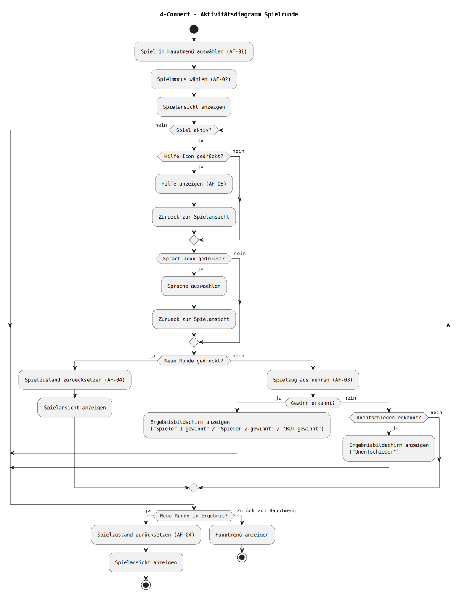
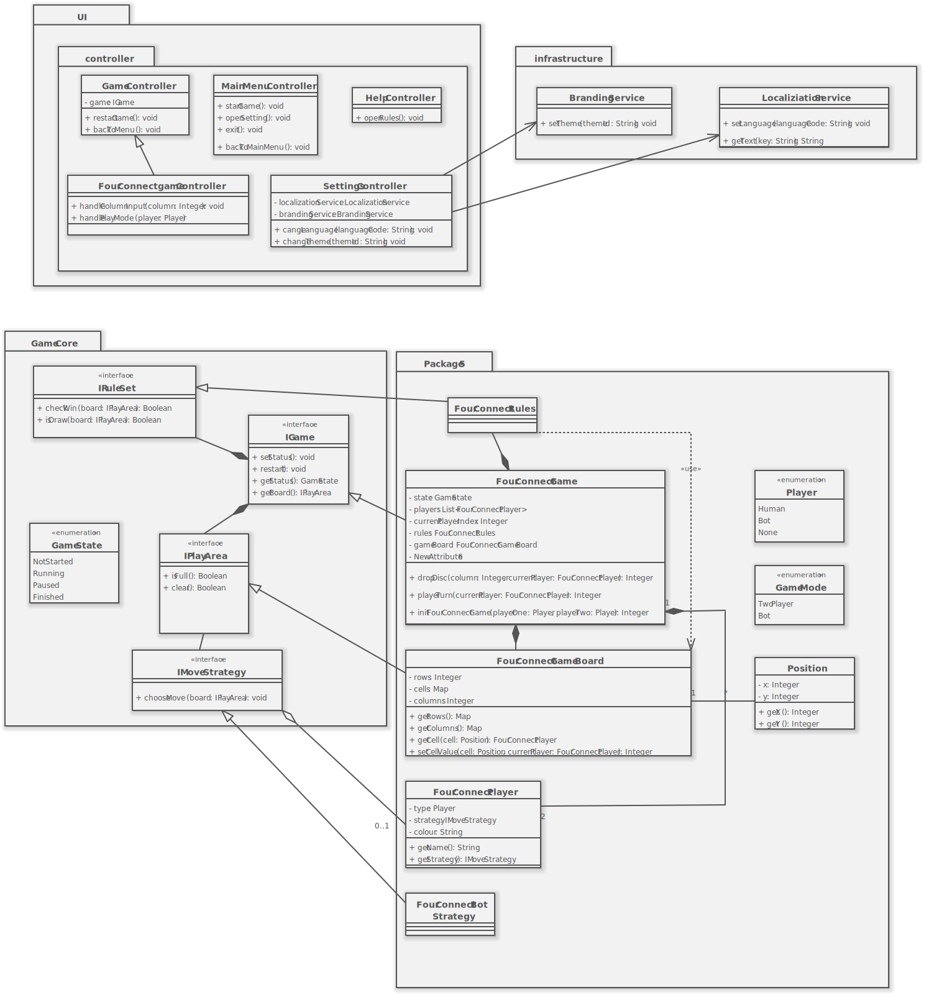

# Inhaltsverzeichnis

1. [Zielbestimmung](#1-zielbestimmung)  
   1.1 [Muss-Kriterien](#11-muss-kriterien)  
   1.2 [Kann-Kriterien](#12-kann-kriterien)  
   1.3 [Abgrenzungskriterien](#13-abgrenzungskriterien)  

2. [Produkteinsatz](#2-produkteinsatz)  
   2.1 [Anwendungsbereich](#21-anwendungsbereich)  
   2.2 [Zielgruppen](#22-zielgruppen)  
   2.3 [Produktumgebung](#23-produktumgebung)  
   &nbsp;&nbsp;&nbsp;&nbsp;2.3.1 [Architektur](#231-architektur)  
   &nbsp;&nbsp;&nbsp;&nbsp;2.3.2 [Technologie](#232-technologie)  
   &nbsp;&nbsp;&nbsp;&nbsp;2.3.3 [Komponenten](#233-komponenten)  
   &nbsp;&nbsp;&nbsp;&nbsp;2.3.4 [Schnittstellen](#234-schnittstellen)  
   2.4 [Betriebsbedingungen](#24-betriebsbedingungen)  

3. [Produktfunktionen / Anforderungen](#3-produktfunktionen--anforderungen)  
   3.1 [Funktionale Anforderungen](#31-funktionale-anforderungen)  
   &nbsp;&nbsp;&nbsp;&nbsp;3.1.1 [Beschreibung der FA mit Rollen innerhalb der Geschäftsprozesse](#311-beschreibung-der-fa-mit-rollen-innerhalb-der-geschäftsprozesse)  
   &nbsp;&nbsp;&nbsp;&nbsp;3.1.2 [Aktivitäten mit Benutzerschnittstelle (UI)](#312-aktivitäten-mit-benutzerschnittstelle-ui)  
   &nbsp;&nbsp;&nbsp;&nbsp;3.1.3 [Fachliches Klassendiagramm (Domain Model) / Produktdaten](#313-fachliches-klassendiagramm-domain-model--produktdaten)  
   3.2 [Nichtfunktionale Anforderungen](#32-nichtfunktionale-anforderungen)  
   &nbsp;&nbsp;&nbsp;&nbsp;3.2.1 [Benutzbarkeit](#321-benutzbarkeit)  
   &nbsp;&nbsp;&nbsp;&nbsp;3.2.2 [Zuverlässigkeit](#322-zuverlässigkeit)  
   &nbsp;&nbsp;&nbsp;&nbsp;3.2.3 [Effizienz](#323-effizienz)  
   &nbsp;&nbsp;&nbsp;&nbsp;3.2.4 [Softwarewartung](#324-softwarewartung)  
   &nbsp;&nbsp;&nbsp;&nbsp;3.2.5 [Sicherheit](#325-sicherheit)  
   &nbsp;&nbsp;&nbsp;&nbsp;3.2.6 [Normen](#326-normen)  

4. [Testung](#4-testung)  

5. [Monitoring / Support bei Übergabe oder ähnliche Leistungen](#5-monitoring--support-bei-übergabe-oder-ähnliche-leistungen)  

6. [Dokumentation](#6-dokumentation)  
   6.1 [Anwenderdokumentation](#61-anwenderdokumentation)  
   6.2 [Administratorendokumentation](#62-administratorendokumentation)  
   6.3 [Entwicklerdokumentation](#63-entwicklerdokumentation)  
   6.4 [Weitere referenzierte Dokumente](#64-weitere-referenzierte-dokumente)  

7. [Vorgehen](#7-vorgehen)  

8. [Entwicklungsumgebung](#8-entwicklungsumgebung)  

9. [Glossar](#9-glossar)

# Projektdokumentation

## 1 Zielbestimmung

Ziel dieses Projekts ist die Konzeption und Umsetzung einer offlinefähigen Spieleapplikation zur Erweiterung eines bestehenden Inflight-Entertainment-Systems. Die Applikation soll Passagieren während des Fluges ein leicht verständliches und unterhaltsames Spielangebot bereitstellen und sich dabei nahtlos in die vorhandene Systemlandschaft integrieren.

Im Rahmen dieses Pflichtenhefts werden die funktionalen und nicht-funktionalen Eigenschaften des zu entwickelnden Produkts konkretisiert. Die Zielbestimmung dient als verbindliche Grundlage für Entwicklung, Test, Abnahme und Übergabe des Systems.

### 1.1 Muss-Kriterien
| ID  | Name | Beschreibung |
| :-- | :--: | :-- |
| MK100 | Eingabe | Die Bedienung erfolgt über Touch- oder Maussteuerung. |
| MK101 | UI-Aufbau | Wiederverwendbare UI- und Navigationskomponenten müssen bereitgestellt werden. |
| MK102 | Gegnerauswahl | Es gibt einen Auswahlbildschirm für die Modusauswahl(Bot/1v1). |
| MK103 | End-Screen | Es gibt einen Endbildschirm, um den Ausgang des Spiels anzuzeigen. |
| MK104 | Spielregeln | Die Anwendung muss eine verständliche Darstellung der Spielregeln bereitstellen. |
| MK201 | Programmiersprache | Die Anwendung muss in der Programmiersprache Java implementiert und auf der vom Auftraggeber bereitgestellten IFE-Hardware lauffähig sein. |
| MK202 | Offlinezwang | Die Nutzung der Anwendung muss vollständig offline möglich sein. |
| MK203 | Muster Spiel | Es ist möglich das Spiel 4-Gewinnt zu spielen. |
| MK204 | Multiplayer | Das System muss einen Mehrspielermodus für zwei Passagiere auf einem gemeinsamen Sitzmonitor bereitstellen. |
| MK205 | Singleplayer | Das System muss einen Einzelspielermodus gegen einen Bot unterstützen. |
| MK206 | Spielzüge | Spielzüge müssen regelkonform verarbeitet und umgesetzt werden. |
| MK207 | Win-Condition | Das System muss erkennen, wenn ein Spieler gewonnen hat. |
| MK208 | Unentschieden | Das System muss erkennen, wenn keine weiteren Spielzüge mehr möglich sind und das Spiel als "Unentschieden" beenden. |
| MK209 | Neustart | Ein laufendes Spiel muss jederzeit neu gestartet werden können. |
| MK210 | Rückkehr | Die Anwendung muss jederzeit korrekt in das IFE-Hauptmenü zurückkehren können. |
| MK300 | Datenverarbeitung | Es dürfen keine personenbezogenen Daten erfasst, gespeichert oder übertragen werden. |
| MK301 | Modularität | Die Architektur ist modular aufgebaut, damit zukünftige Erweiterungen um weitere Spiele mit geringem Aufwand möglich sind. |

### 1.2 Kann-Kriterien
| ID  | Name | Beschreibung |
| :-- | :--: | :-- |
| KK100 | Anzeigesprache | Die Sprache der Benutzeroberfläche kann an verschiedene Sprachen angepasst werden. |
| KK101 | CI-Anpassung | Die Benutzeroberfläche kann an die Corporate Identity verschiedener Airlines angepasst werden (z. B. Farben, Logos, UI-Assets). |
| KK102 | Animationen | Visuelles Feedback oder einfache Animationen bei Spielzügen können implementiert werden. |
| KK200 | Schwierigkeitsstufen | Der Computergegner kann optional in unterschiedlichen Schwierigkeitsstufen angeboten werden. |

### 1.3 Abgrenzungskriterien
| ID  | Name | Beschreibung |
| :-- | :--: | :-- |
| AK100 | Werbung | Werbung oder Monetarisierung sind nicht vorgesehen. |
| AK200 | Netzwerk Multiplayer | Eine Mehrspielerfunktion über mehrere Sitzplätze hinweg wird nicht umgesetzt. |
| AK300 | Internetverbindung | Funktionen, die eine Netzwerk- oder Internetverbindung erfordern sind nicht Bestandteil des Systems. |
| AK301 | Sicherheit | Es erfolgt keine Anbindung an sicherheitskritische oder avionische Systeme. |
| AK302 | Datenspeicherung | Die Speicherung von Spielständen, Statistiken oder Nutzerdaten ist ausgeschlossen. |

## 2 Produkteinsatz

### 2.1 Anwendungsbereich
Die im Rahmen dieses Auftrags entwickelte Software wird als Applikation innerhalb des bestehenden IFE des Auftraggebers eingesetzt. Sie dient ausschließlich der Unterhaltung der Passagiere während des Fluges. Der Einsatz der Software erfolgt auf den Sitzmonitoren der Passagiere. Ziel ist es, ein leicht zugängliches und intuitiv bedienbares Spiel bereitzustellen, das ohne zusätzliche technische Voraussetzungen genutzt werden kann.

### 2.2 Zielgruppen
Die primäre Zielgruppe der Anwendung sind Passagiere, die während des Fluges ein gut verständliches und unterhaltsames Spiel nutzen möchten. Die Bedienung ist daher möglichst simpel und auf eine intuitive Nutzung ausgelegt.

Sekundäre Zielgruppen sind Airlines, die das System in ihren Flugzeugen einsetzen. Für diese stehen insbesondere Stabilität, Zuverlässigkeit sowie die eventuelle Anpassung der Benutzeroberfläche an die jeweilige Corporate Identity im Vordergrund. Darüber hinaus richtet sich das Produkt an den Auftraggeber Novaris Cabin Systems, der durch die Erweiterung seines IFE-Portfolios einen zusätzlichen Mehrwert für bestehende und zukünftige Kunden schafft.

### 2.3 Produktumgebung
Die Applikation arbeitet vollständig in der vom IFE vorgebenen Java 21-LTS Runtime und muss unter den vom IFE bereitgestellten Betriebsmitteln funktional sein und diese optimal nutzen.

#### 2.3.1 Technologie
Die Implementierung erfolgt in Java unter Verwendung der vom Auftraggeber vorgegebenen IFE-Laufzeitumgebung. Die grafische Darstellung erfolgt zweidimensional und ist auf Touch-Interaktion optimiert.

#### 2.3.2 Schnittstellen
Die Anwendung nutzt ausschließlich die vom IFE-System bereitgestellten Mechanismen zum Starten und Beenden der Applikation. Eine Kommunikation mit externen Systemen oder die dauerhafte Speicherung von Daten ist nicht vorgesehen.

### 2.4 Betriebsbedingungen
Der Betrieb der Anwendung erfolgt vollständig offline und auf den Sitzmonitoren der Passagiere während des Flugbetriebs. Eine Netzwerkverbindung steht nicht zur Verfügung und darf von der Software nicht vorausgesetzt werden. Die Anwendung muss unter diesen Bedingungen stabil und zuverlässig funktionieren.

Die Software ist für den Dauerbetrieb innerhalb des IFE-Systems ausgelegt und muss auch bei wiederholter oder schneller Benutzereingabe zuverlässig reagieren. Darüber hinaus ist zu berücksichtigen, dass die Nutzung unter den im Flugbetrieb stark wechselnden Lichtverhältnissen und aus unterschiedlichen Blickwinkeln erfolgt. Die Benutzeroberfläche muss daher gut erkennbar und kontrastreich gestaltet sein.

## 3 Produktfunktionen / Anforderungen

### 3.1 Funktionale Anforderungen

#### 3.1.1 Beschreibung der funktionalen Anforderungen mit Rollen innerhalb der Geschäftsprozesse  
 
Im exemplarischen Prozess "FourConnect spielen" interagiert ein Nutzer über die grafische Benutzerschnittstelle mit der Anwendung. Die Benutzereingaben werden durch Controller verarbeitet, welche die Spiellogik des GameCore verwenden. Der Fluggast wählt ein Spiel, konfiguriert den Spielmodus, führt Spielaktionen aus und kann optional die Spielhilfe aufrufen.

Muss Kriterien:  
|AF Nr |Name |Beschreibung |    
|------|-----|-------------|
|AF-01 |Spiel starten/auswählen |Der Fluggast wählt aus der ihm vorliegendem Spielesammlung ein Spiel aus. Das ausgewählte Spiel wird anschließend gestartet und angezeigt. |
|AF-02 |Spielmodus wählen |Der Fluggast wählt zwischen den Spielmodi: "Spieler gegen Spieler" oder "Spieler gegen Bot". |
|AF-03 |Spielstein setzen |Der Fluggast wählt ein Feld oder eine Reihe im Spielfeld aus, der Spielstein dieses Spielers fällt daraufhin von oben in die Reihe und bleibt auf dem niedrigsten freien Platz liegen. |
|AF-04 |Neue Runde starten |Nach dem Abschluss eines Spiels ist es dem Fluggast möglich eine neue Runde zu starten durch einen Knopfdruck. |
|AF-05 |Spielhilfe aufrufen |Vor, im Laufe oder nach Beendigung des Spieles, ist es dem Fluggast möglich eine Spielhilfe, mit den Grundlegenden Regeln des Spieles aufzurufen. |
|AF-06 |Spielfeld zurücksetzen |Im Laufe des Spieles, ist es dem Fluggast möglich das Spielfeld zu seinem Ausgangszustand zurückzusetzen.| 
|AF-07 |Rückkehr zur Spielesammlung |Im Laufe eines Spieles oder nach Beendigung einer Runde, ist es dem Fluggast möglich zur Spielesammlung zurückzukehren.|

Kann Kriterien:  
|KF Nr|Name|Beschreibung| 
|------|-----|-------------|
|KF-01| Localization| Dem Fluggast ist es möglich, über ein separates Menü zwischen einer Auswahl an Sprachen zu wählen|
|KF-02| CI-UI-Anpassung| Den Flugbetreibern ist es möglich, die Farben der Spielsteine anzupassen.

#### 3.1.2 Aktivitäten mit Benutzerschnittstelle (UI)

Die folgenden UI-Diagramme dienen der Veranschaulichung der Benutzerinteraktion.  
Der Screenflow zeigt die Navigation zwischen den einzelnen Bildschirmen.  
Die Wireframes skizzieren die grundlegende Anordnung und Funktion der Bedienelemente (Low-Fidelity) und definieren das Bedienkonzept, ohne ein finales Design festzulegen.

**Abbildung:** Screenflow der Benutzeroberfläche  

|Anwendungsfall ID | AF-01|
|-------|-------------|
|AF Name| Spiel starten/auswählen   |
|Akteur| Fluggast    |
|Vorbedingungen| Anwendung ist gestartet, Spielmenü wird angezeigt    |
|Auslösendes Ereignis| Auswahl eines Spieles  |
|Nachbedingung Erfolg| Anzeige der Spielmoduswahl |
|Nachbedingung Fehlschlag| Spiel konnte nicht initialisiert werden, Verbleib im Hauptmenü  |
|Ablauf| Auswahl des Spieles im Hauptmenü    |
|Benutzerschnittstelle| |  

**Abbildung:** Wireframe – Hauptmenü  

|Anwendungsfall ID| AF-02|
|------|-------------|
|AF Name| Spielmodus wählen  |
|Akteur| Fluggast    |
|Vorbedingungen| Das Spiel "4Connect" wurde ausgewählt |
|Auslösendes Ereignis| Auswahl eines Spielmodus |
|Nachbedingung Erfolg| Spiel wird initialisiert, Spielansicht wird angezeigt  |
|Nachbedingung Fehlschlag| Spiel konnte nicht initialisiert werden, Rückkehr zum Hauptmenü  |
|Ablauf | - Auswahl des Spieles im Hauptmenü    - Auswahl des Spielmodus (Zwei Spieler oder Bot)  - Initialisierung des Spieles   - Anzeige der Spielansicht |
|Benutzerschnittstelle| |  

**Abbildung:** Wireframe – Modusmenü  

|Anwendungsfall ID| AF-03|  
|-----|-------------|
|AF Name| Spielstein setzen   |
|Akteur| Fluggast   |
|Vorbedingungen| Spielansicht geöffnet, Spielstand = laufend   |
|Auslösendes Ereignis| Auswahl einer Spalte durch den Fluggast  |
|Nachbedingung Erfolg| Spielstein platziert, Spielfeld aktualisiert, Spielerwechsel  |
|Nachbedingung Fehlschlag| Ungültige oder volle Spalte, kein Zustandswechsel  |
|Ablauf| - Auswahl einer Spalte   - Übergabe der Eingabe an den Controller   - Platzierung des Spielsteins   - Prüfung auf Spielende (Sieg/Unentschieden)   - Spielerwechsel      |
|Benutzerschnittstelle| |  

**Abbildung:** Wireframe – Spielansicht  

**Abbildung:** Wireframe – Sprachauswahl (über Sprach-Icon)  

|Anwendungsfall ID| AF-04|
|------|-------------|
|AF Name| Neue Runde starten   |
|Akteur| Fluggast   |
|Vorbedingungen| Spielrunde ist beendet    |
|Auslösendes Ereignis| Bestätigung der Schaltstelle "Neue Runde" |
|Nachbedingung Erfolg| Neue Runde startet mit leerem Spielfeld  |
|Nachbedingung Fehlschlag| Neue Runde konnte nicht gestartet werden  |
|Ablauf| - Anzeige des Endzustands  - Bestätigung der Schaltfläche "Neue Runde"    |
|Benutzerschnittstelle| |  

**Abbildung:** Wireframe – Neue Runde starten  

|Anwendungsfall ID| AF-05|
|-----|-------------|
|AF Name| Spielhilfe aufrufen   |
|Akteur| Fluggast    |
|Vorbedingungen| Spiel oder Hauptmenü ist geöffnet    |
|Auslösendes Ereignis| Auswahl "Spielhilfe"  |
|Nachbedingung Erfolg| Spielhilfe mit Regeln wird angezeigt  |
|Nachbedingung Fehlschlag| Spielhilfe kann nicht angezeigt werden  |
|Ablauf| - Auswahl der Spielhilfe  - Anzeige der grundlegenden Spielregeln      |
|Benutzerschnittstelle| |  

**Abbildung:** Wireframe – Hilfe / Regeln  

|Anwendungsfall ID| AF-06|
|-----|-------------|
|AF Name| Spielfeld zurücksetzen   |
|Akteur| Fluggast    |
|Vorbedingungen| Ein Spiel ist in Betrieb    |
|Auslösendes Ereignis| Auswahl Schaltfläche "Zurücksetzen"  |
|Nachbedingung Erfolg| Das Spielfeld wird zurückgesetzt auf seinen Ausgangszustand  |
|Nachbedingung Fehlschlag| Spielfeld wird nicht zurückgesetzt  |
|Ablauf| - Auswahl der Schaltfläche "Zurücksetzen"  - Spielfläche wird von den Spielsteinen geleert  - Anzeige des neuen leeren Spielfeldes       |
|Benutzerschnittstelle| |  

**Abbildung:** Wireframe – Spielansicht  

|Anwendungsfall ID| AF-07|
|-----|-------------|
|AF Name| Rückkehr zur Spielesammlung   |
|Akteur| Fluggast    |
|Vorbedingungen| - Ein Spiel ist in Betrieb <brb/> - Ein Spiel ist beendet     |
|Auslösendes Ereignis| Auswahl Schaltfläche "Spielesammlung"  |
|Nachbedingung Erfolg| Die vorhandene Spielesammlung wird angezeigt |
|Nachbedingung Fehlschlag| Das aktuelle Spiel wird weiter angezeigt  |
|Ablauf| - Auswahl der Schaltfläche "Spielesammlung"  - Anzeige der Spielesammlung  |
|Benutzerschnittstelle| | 

**Abbildung:** Wireframe – Spielansicht  

**Abbildung:** Wireframe – Ergebnisbildschirm  

Das Aktivitätsdiagramm stellt den Ablauf einer Spielrunde einschließlich optionaler Aktionen (Spielhilfe, Sprachwahl) sowie der Behandlung von Spielende und Neustart dar.
**Abbildung:** Aktivitätsdiagramm – Spielrunde  

#### 3.1.3 Fachliches Klassendiagramm (Domain Model) / Produktdaten

**Abbildung:** Klassendiagramm

### 3.2 Nichtfunktionale Anforderungen

#### 3.2.1 Benutzbarkeit
**NF-B1 Benutzung**  
Die Anwendung soll ausschließlich über eine grafische Benutzeroberfläche bedient werden. Alle Funktionen müssen über eindeutig beschriftete Bedienelemente erreichbar sein. Die Bedienung soll zudem ohne zusätzliche Schulung möglich sein.

#### 3.2.2 Zuverlässigkeit
**NF-Z1 Zuverlässiger Betrieb**  
Die Anwendung muss während der Nutzung stabil laufen. Ungültige Benutzereingaben dürfen nicht zum Absturz der Anwendung führen. Auch fehlerhalfte Spielzüge müssen abgefangen werden.

#### 3.2.3 Effizienz
**NF-E1 Effizienz**  
Die Verarbeitung von Benutzereingaben und die Aktualisierung der Benutzoberfläche sollen unmittelbar erfolgen. Spielzüge müssen ohne wahrnehmbare Verzögerung dargestellt werden. Menüwechsel und Anzeigen müssen direkt erfolgen.

#### 3.2.4 Softwarewartung
**NF-W1 Softwarewartung**  
Die Anwendung soll so aufgebaut sein, dass zukünftige Erweiterungen mit geringem Aufwand möglich sind. Erweiterungen an den Sprachen und des Designs sollen ohne grundlegende Änderungen an der Spiellogik möglich sein. Erweiterungen an der Spielesammlung sollen die Logik der anderen Spiele nicht beeinträchtigen oder verändern.

#### 3.2.5 Sicherheit
**NF-S1 Sicherheit**  
Für die Anwendung liegen keine besonderen Sicherheitsanforderungen vor. Es werden zudem keine personenbezogenen Daten dauerhaft gespeichert. Für die Fluggäste ist keine besondere Authentifizierung oder Autorisierung erforderlich.

#### 3.2.6 Normen
**NF-N1 Normen**   
Die Anwendung ist als Unterhaltungssoftware für Fluggäste konzipiert und ist nicht Bestandteil sicherheitskritischer Flugzeugsysteme. Es besteht keinerlei Anbindung an Flugsteuerungs-, Navigations- oder Kommunikationssysteme. Die Anwendung muss sonst keine gesetzlichen Vorgaben erfüllen.

## 4 Testung

Zur Sicherstellung der Qualität wird das System kontinuierlich auf dem bereitgestellten Dev-Kit getestet. Die Testaktivitäten umfassen Funktionstests zur Überprüfung aller spezifizierten Anforderungen, Usability-Tests zur Bewertung der Bedienbarkeit über Touch-Eingaben sowie Stabilitäts- und Belastungstests bei wiederholter und schneller Eingabe. Dabei auftretende Fehler werden je nach schwere umgehend behoben oder Dokumentiert.

## 5 Monitoring / Support bei Übergabe oder ähnliche Leistungen

Im Rahmen der Übergabe wird ein zeitlich, auf einen Monat begrenzter, Support bereitgestellt. Dieser umfasst die Unterstützung bei der Inbetriebnahme auf der Zielhardware, die Behebung unmittelbar auftretender Fehler sowie die Unterstützung bei Konfigurations- oder Integrationsfragen.

Nach erfolgreicher Übergabe werden aller relevanten Dokumente und Ressourcen einschließlich Quellcode, Build-Anweisungen und Dokumentation an den Auftraggeber übergeben. Ein dauerhaftes Monitoring oder ein langfristiger Betriebssupport wird nicht Bereitgestellt.

## 6 Dokumentation

### 6.1 Anwenderdokumentation

### 6.2 Administratorendokumentation

### 6.3 Entwicklerdokumentation

### 6.4 Weitere referenzierte Dokumente

## 7 Vorgehen

## 8 Entwicklungsumgebung

## 9 Glossar

