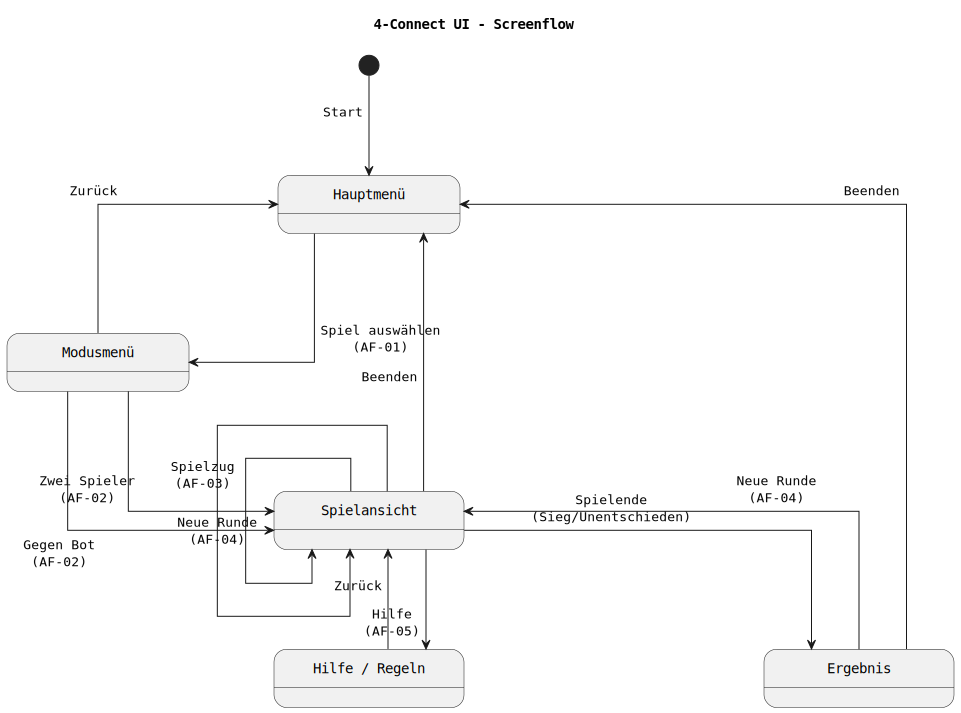
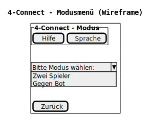
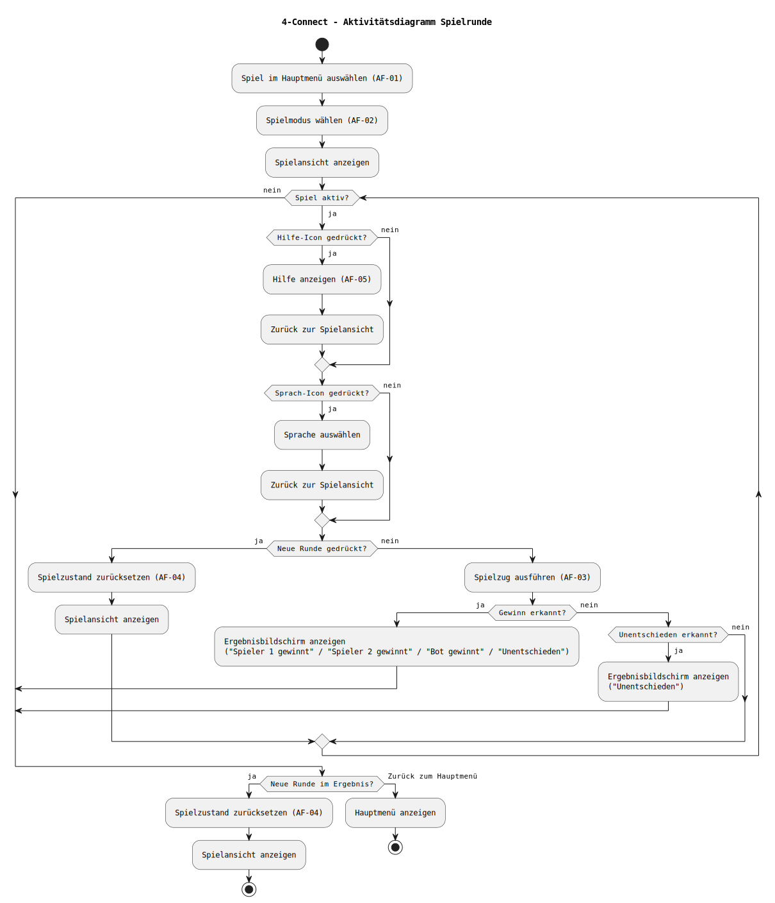
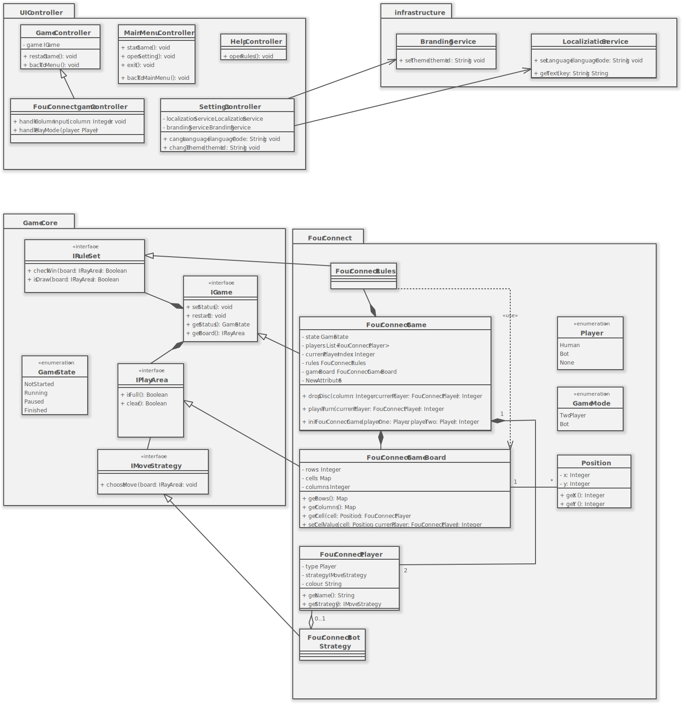

## Entwicklung einer Entertainment-Erweiterung speziell für IFE
**Stand:** 21.01.2025  

**Auftraggeber:** Novaris Cabin Systems GmbH  
Friedrich-List-Platz 1   
01069 Dresden  
**Ansprechpartner*in:** Lea Wagner  
**E-Mail:** lwagner@novaris-cabinystems.de   
**Telefon:** 0351 4620   

**Auftragnehmer:** Gervithrall Systems GmbH   
Perlickstraße 1   
04103 Leipzig   
**Ansprechpartner*in:** Lucas Rumann   
**E-Mail:** lucasr@gervithrall-systems.de   
**Telefon:** 0351 6482642   

---

# Inhaltsverzeichnis

1. [Zielbestimmung](#1-zielbestimmung)  
   1.1 [Muss-Kriterien](#11-muss-kriterien)  
   1.2 [Kann-Kriterien](#12-kann-kriterien)  
   1.3 [Abgrenzungskriterien](#13-abgrenzungskriterien)  

2. [Produkteinsatz](#2-produkteinsatz)  
   2.1 [Anwendungsbereich](#21-anwendungsbereich)  
   2.2 [Zielgruppen](#22-zielgruppen)  
   2.3 [Produktumgebung](#23-produktumgebung)  
   &nbsp;&nbsp;&nbsp;&nbsp;2.3.1 [Technologie](#231-technologie)  
   &nbsp;&nbsp;&nbsp;&nbsp;2.3.2 [Schnittstellen](#232-schnittstellen)  
   2.4 [Betriebsbedingungen](#24-betriebsbedingungen)  

3. [Produktfunktionen / Anforderungen](#3-produktfunktionen--anforderungen)  
   3.1 [Funktionale Anforderungen](#31-funktionale-anforderungen)  
   &nbsp;&nbsp;&nbsp;&nbsp;3.1.1 [Beschreibung der FA mit Rollen innerhalb der Geschäftsprozesse](#311-beschreibung-der-funktionalen-anforderungen-mit-rollen-innerhalb-der-geschäftsprozesse)  
   &nbsp;&nbsp;&nbsp;&nbsp;3.1.2 [Aktivitäten mit Benutzerschnittstelle (UI)](#312-aktivitäten-mit-benutzerschnittstelle-ui)  
   &nbsp;&nbsp;&nbsp;&nbsp;3.1.3 [Fachliches Klassendiagramm (Domain Model) / Produktdaten](#313-fachliches-klassendiagramm-domain-model--produktdaten)  
   3.2 [Nichtfunktionale Anforderungen](#32-nichtfunktionale-anforderungen)  
   &nbsp;&nbsp;&nbsp;&nbsp;3.2.1 [Benutzbarkeit](#321-benutzbarkeit)  
   &nbsp;&nbsp;&nbsp;&nbsp;3.2.2 [Zuverlässigkeit](#322-zuverlässigkeit)  
   &nbsp;&nbsp;&nbsp;&nbsp;3.2.3 [Effizienz](#323-effizienz)  
   &nbsp;&nbsp;&nbsp;&nbsp;3.2.4 [Softwarewartung](#324-softwarewartung)  
   &nbsp;&nbsp;&nbsp;&nbsp;3.2.5 [Sicherheit](#325-sicherheit)  
   &nbsp;&nbsp;&nbsp;&nbsp;3.2.6 [Normen](#326-normen)  

4. [Testung](#4-testung)  

5. [Monitoring / Support bei Übergabe oder ähnliche Leistungen](#5-monitoring--support-bei-übergabe-oder-ähnliche-leistungen)  

6. [Dokumentation](#6-dokumentation)  
   6.1 [Anwenderdokumentation](#61-anwenderdokumentation)  
   6.2 [Administratorendokumentation](#62-administratorendokumentation)  
   6.3 [Entwicklerdokumentation](#63-entwicklerdokumentation)  
   6.4 [Weitere referenzierte Dokumente](#64-weitere-referenzierte-dokumente)  

7. [Vorgehen](#7-vorgehen)   
   7.1 [Vorgehensmodell](#71-vorgehensmodell)   
   7.2 [Arbeitspakete und Ablauf](#72-arbeitspakete-und-ablauf)   
   7.3 [Meilensteine und Zeitplan](#73-meilensteine-und-zeitplan)   
   7.4 [Qualitätssicherung und Tests](#74-qualitätssicherung-und-tests)   
   7.5 [Konfigurations- und Änderungsmanagement](#75-konfigurations--und-änderungsmanagement)   
   7.6 [Kommunikation und Projektdokumentation](#76-kommunikation-und-projektdokumentation)   
   7.7 [Risiken und Gegenmaßnahmen](#77-risiken-und-gegenmaßnahmen)   

8. [Entwicklungsumgebung](#8-entwicklungsumgebung)   
   8.1 [Zielumgebung und Rahmenbedingungen](#81-zielumgebung-ife-und-rahmenbedingungen)   
   8.2 [Tooling- und Versionsübersicht](#82-tooling--und-versionsübersicht)   
   &nbsp;&nbsp;&nbsp;&nbsp;8.2.1 [Implementierung und Laufzeit](#821-implementierung-und-laufzeit)   
   &nbsp;&nbsp;&nbsp;&nbsp;8.2.2 [Versionsverwaltung und Kollaboration](#822-versionsverwaltung-und-kollaboration)   
   &nbsp;&nbsp;&nbsp;&nbsp;8.2.3 [Diagramme, Modellierung und Doku-Tools](#823-diagramme-modellierung-und-doku-tools)   
   &nbsp;&nbsp;&nbsp;&nbsp;8.2.4 [UI/UX, Prototyping und Layout](#824-uiux-prototyping-und-layout)   
   &nbsp;&nbsp;&nbsp;&nbsp;8.2.5 [Build/Obfuscation](#825-buildobfuscation)   
   8.3 [Modellierung, Diagramme und Ablageorte](#83-modellierung-diagramme-und-ablageorte)   
   &nbsp;&nbsp;&nbsp;&nbsp;8.3.1 [Export-Dateien](#831-export-dateien-svg)   
   &nbsp;&nbsp;&nbsp;&nbsp;8.3.2 [Quelldateien](#832-quelldateien)   
   8.4 [Build, Tests und Dokumentation](#84-build-tests-und-dokumentation)   
   &nbsp;&nbsp;&nbsp;&nbsp;8.4.1 [Build / Auslieferung](#841-build--auslieferung)   
   &nbsp;&nbsp;&nbsp;&nbsp;8.4.2 [Tests](#842-tests)   
   &nbsp;&nbsp;&nbsp;&nbsp;8.4.3 [Projektdokumentation](#843-projektdokumentation)   
   8.5 [Konventionen und Qualitätssicherung](#85-konventionen-und-qualitätssicherung)   

9. [Glossar](#9-glossar)

---

## 1 Zielbestimmung

Ziel dieses Projekts ist die Konzeption und Umsetzung einer offlinefähigen Spieleapplikation zur Erweiterung eines bestehenden Inflight-Entertainment-Systems. Die Applikation soll Passagieren während des Fluges ein leicht verständliches und unterhaltsames Spielangebot bereitstellen und sich dabei nahtlos in die vorhandene Systemlandschaft integrieren.

Im Rahmen dieses Pflichtenhefts werden die funktionalen und nicht-funktionalen Eigenschaften des zu entwickelnden Produkts konkretisiert. Die Zielbestimmung dient als verbindliche Grundlage für Entwicklung, Test, Abnahme und Übergabe des Systems.

### 1.1 Muss-Kriterien
| ID  | Name | Beschreibung |
| :-- | :--: | :-- |
| MK100 | Eingabe | Die Bedienung erfolgt über Touch- oder Maussteuerung. |
| MK101 | UI-Aufbau | Wiederverwendbare UI- und Navigationskomponenten müssen bereitgestellt werden. |
| MK102 | Gegnerauswahl | Es gibt einen Auswahlbildschirm für die Modusauswahl(Bot/1v1). |
| MK103 | End-Screen | Es gibt einen Endbildschirm, um den Ausgang des Spiels anzuzeigen. |
| MK104 | Spielregeln | Die Anwendung muss eine verständliche Darstellung der Spielregeln bereitstellen. |
| MK201 | Programmiersprache | Die Anwendung muss in der Programmiersprache Java implementiert und auf der vom Auftraggeber bereitgestellten IFE-Hardware lauffähig sein. |
| MK202 | Offlinezwang | Die Nutzung der Anwendung muss vollständig offline möglich sein. |
| MK203 | Muster Spiel | Es ist möglich das Spiel 4-Gewinnt zu spielen. |
| MK204 | Multiplayer | Das System muss einen Mehrspielermodus für zwei Passagiere auf einem gemeinsamen Sitzmonitor bereitstellen. |
| MK205 | Singleplayer | Das System muss einen Einzelspielermodus gegen einen Bot unterstützen. |
| MK206 | Spielzüge | Spielzüge müssen regelkonform verarbeitet und umgesetzt werden. |
| MK207 | Win-Condition | Das System muss erkennen, wenn ein Spieler gewonnen hat. |
| MK208 | Unentschieden | Das System muss erkennen, wenn keine weiteren Spielzüge mehr möglich sind und das Spiel als "Unentschieden" beenden. |
| MK209 | Neustart | Ein laufendes Spiel muss jederzeit neu gestartet werden können. |
| MK210 | Rückkehr | Die Anwendung muss jederzeit korrekt in das IFE-Hauptmenü zurückkehren können. |
| MK300 | Datenverarbeitung | Es dürfen keine personenbezogenen Daten erfasst, gespeichert oder übertragen werden. |
| MK301 | Modularität | Die Architektur ist modular aufgebaut, damit zukünftige Erweiterungen um weitere Spiele mit geringem Aufwand möglich sind. |

### 1.2 Kann-Kriterien
| ID  | Name | Beschreibung |
| :-- | :--: | :-- |
| KK100 | Anzeigesprache | Die Sprache der Benutzeroberfläche kann an verschiedene Sprachen angepasst werden. |
| KK101 | CI-Anpassung | Die Benutzeroberfläche kann an die Corporate Identity verschiedener Airlines angepasst werden (z. B. Farben, Logos, UI-Assets). |
| KK102 | Animationen | Visuelles Feedback oder einfache Animationen bei Spielzügen können implementiert werden. |
| KK200 | Schwierigkeitsstufen | Der Computergegner kann optional in unterschiedlichen Schwierigkeitsstufen angeboten werden. |

### 1.3 Abgrenzungskriterien
| ID  | Name | Beschreibung |
| :-- | :--: | :-- |
| AK100 | Werbung | Werbung oder Monetarisierung sind nicht vorgesehen. |
| AK200 | Netzwerk Multiplayer | Eine Mehrspielerfunktion über mehrere Sitzplätze hinweg wird nicht umgesetzt. |
| AK300 | Internetverbindung | Funktionen, die eine Netzwerk- oder Internetverbindung erfordern sind nicht Bestandteil des Systems. |
| AK301 | Sicherheit | Es erfolgt keine Anbindung an sicherheitskritische oder avionische Systeme. |
| AK302 | Datenspeicherung | Die Speicherung von Spielständen, Statistiken oder Nutzerdaten ist ausgeschlossen. |

---

## 2 Produkteinsatz

### 2.1 Anwendungsbereich
Die im Rahmen dieses Auftrags entwickelte Software wird als Applikation innerhalb des bestehenden IFE des Auftraggebers eingesetzt. Sie dient ausschließlich der Unterhaltung der Passagiere während des Fluges. Der Einsatz der Software erfolgt auf den Sitzmonitoren der Passagiere. Ziel ist es, ein leicht zugängliches und intuitiv bedienbares Spiel bereitzustellen, das ohne zusätzliche technische Voraussetzungen genutzt werden kann.

### 2.2 Zielgruppen
Die primäre Zielgruppe der Anwendung sind Passagiere, die während des Fluges ein gut verständliches und unterhaltsames Spiel nutzen möchten. Die Bedienung ist daher möglichst simpel und auf eine intuitive Nutzung ausgelegt.

Sekundäre Zielgruppen sind Airlines, die das System in ihren Flugzeugen einsetzen. Für diese stehen insbesondere Stabilität, Zuverlässigkeit sowie die eventuelle Anpassung der Benutzeroberfläche an die jeweilige Corporate Identity im Vordergrund. Darüber hinaus richtet sich das Produkt an den Auftraggeber Novaris Cabin Systems, der durch die Erweiterung seines IFE-Portfolios einen zusätzlichen Mehrwert für bestehende und zukünftige Kunden schafft.

### 2.3 Produktumgebung
Die Applikation arbeitet vollständig in der vom IFE vorgebenen Java 21-LTS Runtime und muss unter den vom IFE bereitgestellten Betriebsmitteln funktional sein und diese optimal nutzen.

#### 2.3.1 Technologie
Die Implementierung erfolgt in Java unter Verwendung der vom Auftraggeber vorgegebenen IFE-Laufzeitumgebung. Die grafische Darstellung erfolgt zweidimensional und ist auf Touch-Interaktion optimiert.

#### 2.3.2 Schnittstellen
Die Anwendung nutzt ausschließlich die vom IFE-System bereitgestellten Mechanismen zum Starten und Beenden der Applikation. Eine Kommunikation mit externen Systemen oder die dauerhafte Speicherung von Daten ist nicht vorgesehen.

### 2.4 Betriebsbedingungen
Der Betrieb der Anwendung erfolgt vollständig offline und auf den Sitzmonitoren der Passagiere während des Flugbetriebs. Eine Netzwerkverbindung steht nicht zur Verfügung und darf von der Software nicht vorausgesetzt werden. Die Anwendung muss unter diesen Bedingungen stabil und zuverlässig funktionieren.

Die Software ist für den Dauerbetrieb innerhalb des IFE-Systems ausgelegt und muss auch bei wiederholter oder schneller Benutzereingabe zuverlässig reagieren. Darüber hinaus ist zu berücksichtigen, dass die Nutzung unter den im Flugbetrieb stark wechselnden Lichtverhältnissen und aus unterschiedlichen Blickwinkeln erfolgt. Die Benutzeroberfläche muss daher gut erkennbar und kontrastreich gestaltet sein.

---

## 3 Produktfunktionen / Anforderungen

### 3.1 Funktionale Anforderungen

#### 3.1.1 Beschreibung der funktionalen Anforderungen mit Rollen innerhalb der Geschäftsprozesse  
 
Im exemplarischen Prozess "FourConnect spielen" interagiert ein Nutzer über die grafische Benutzerschnittstelle mit der Anwendung. Die Benutzereingaben werden durch Controller verarbeitet, welche die Spiellogik des GameCore verwenden. Der Fluggast wählt ein Spiel, konfiguriert den Spielmodus, führt Spielaktionen aus und kann optional die Spielhilfe aufrufen.

Muss Kriterien:  
|AF Nr |Name |Beschreibung |    
|------|-----|-------------|
|AF-01 |Spiel starten/auswählen |Der Fluggast wählt aus der ihm vorliegendem Spielesammlung ein Spiel aus. Das ausgewählte Spiel wird anschließend gestartet und angezeigt. |
|AF-02 |Spielmodus wählen |Der Fluggast wählt zwischen den Spielmodi: "Spieler gegen Spieler" oder "Spieler gegen Bot". |
|AF-03 |Spielstein setzen |Der Fluggast wählt ein Feld oder eine Reihe im Spielfeld aus, der Spielstein dieses Spielers fällt daraufhin von oben in die Reihe und bleibt auf dem niedrigsten freien Platz liegen. |
|AF-04 |Neue Runde starten |Nach dem Abschluss eines Spiels ist es dem Fluggast möglich eine neue Runde zu starten durch einen Knopfdruck. |
|AF-05 |Spielhilfe aufrufen |Vor, im Laufe oder nach Beendigung des Spieles, ist es dem Fluggast möglich eine Spielhilfe, mit den Grundlegenden Regeln des Spieles aufzurufen. |
|AF-06 |Spielfeld zurücksetzen |Im Laufe des Spieles, ist es dem Fluggast möglich das Spielfeld zu seinem Ausgangszustand zurückzusetzen.| 
|AF-07 |Rückkehr zur Spielesammlung |Im Laufe eines Spieles oder nach Beendigung einer Runde, ist es dem Fluggast möglich zur Spielesammlung zurückzukehren.|

#### 3.1.2 Aktivitäten mit Benutzerschnittstelle (UI)

Die folgenden UI-Diagramme dienen der Veranschaulichung der Benutzerinteraktion.  
Der Screenflow zeigt die Navigation zwischen den einzelnen Bildschirmen.  
Die Wireframes skizzieren die grundlegende Anordnung und Funktion der Bedienelemente (Low-Fidelity) und definieren das Bedienkonzept, ohne ein finales Design festzulegen.

**Abbildung:** Screenflow der Benutzeroberfläche  

|Anwendungsfall ID | AF-01|
|-------|-------------|
|AF Name| Spiel starten/auswählen   |
|Akteur| Fluggast    |
|Vorbedingungen| Anwendung ist gestartet, Spielmenü wird angezeigt    |
|Auslösendes Ereignis| Auswahl eines Spieles  |
|Nachbedingung Erfolg| Anzeige der Spielmoduswahl |
|Nachbedingung Fehlschlag| Spiel konnte nicht initialisiert werden, Verbleib im Hauptmenü  |
|Ablauf| Auswahl des Spieles im Hauptmenü    |
|Benutzerschnittstelle| |  

**Abbildung:** Wireframe – Hauptmenü  

|Anwendungsfall ID| AF-02|
|------|-------------|
|AF Name| Spielmodus wählen  |
|Akteur| Fluggast    |
|Vorbedingungen| Das Spiel "4Connect" wurde ausgewählt |
|Auslösendes Ereignis| Auswahl eines Spielmodus |
|Nachbedingung Erfolg| Spiel wird initialisiert, Spielansicht wird angezeigt  |
|Nachbedingung Fehlschlag| Spiel konnte nicht initialisiert werden, Rückkehr zum Hauptmenü  |
|Ablauf | - Auswahl des Spieles im Hauptmenü    - Auswahl des Spielmodus (Zwei Spieler oder Bot)  - Initialisierung des Spieles   - Anzeige der Spielansicht |
|Benutzerschnittstelle| |  

**Abbildung:** Wireframe – Modusmenü  

|Anwendungsfall ID| AF-03|  
|-----|-------------|
|AF Name| Spielstein setzen   |
|Akteur| Fluggast   |
|Vorbedingungen| Spielansicht geöffnet, Spielstand = laufend   |
|Auslösendes Ereignis| Auswahl einer Spalte durch den Fluggast  |
|Nachbedingung Erfolg| Spielstein platziert, Spielfeld aktualisiert, Spielerwechsel  |
|Nachbedingung Fehlschlag| Ungültige oder volle Spalte, kein Zustandswechsel  |
|Ablauf| - Auswahl einer Spalte   - Übergabe der Eingabe an den Controller   - Platzierung des Spielsteins   - Prüfung auf Spielende (Sieg/Unentschieden)   - Spielerwechsel      |
|Benutzerschnittstelle| |  

**Abbildung:** Wireframe – Spielansicht  

|Anwendungsfall ID| AF-04|
|------|-------------|
|AF Name| Neue Runde starten   |
|Akteur| Fluggast   |
|Vorbedingungen| Spielrunde ist beendet    |
|Auslösendes Ereignis| Bestätigung der Schaltstelle "Neue Runde" |
|Nachbedingung Erfolg| Neue Runde startet mit leerem Spielfeld  |
|Nachbedingung Fehlschlag| Neue Runde konnte nicht gestartet werden  |
|Ablauf| - Anzeige des Endzustands  - Bestätigung der Schaltfläche "Neue Runde"    |
|Benutzerschnittstelle| |  

**Abbildung:** Wireframe – Neue Runde starten  

|Anwendungsfall ID| AF-05|
|-----|-------------|
|AF Name| Spielhilfe aufrufen   |
|Akteur| Fluggast    |
|Vorbedingungen| Spiel oder Hauptmenü ist geöffnet    |
|Auslösendes Ereignis| Auswahl "Spielhilfe"  |
|Nachbedingung Erfolg| Spielhilfe mit Regeln wird angezeigt  |
|Nachbedingung Fehlschlag| Spielhilfe kann nicht angezeigt werden  |
|Ablauf| - Auswahl der Spielhilfe  - Anzeige der grundlegenden Spielregeln      |
|Benutzerschnittstelle| |  

**Abbildung:** Wireframe – Hilfe / Regeln  

|Anwendungsfall ID| AF-06|
|-----|-------------|
|AF Name| Spielfeld zurücksetzen   |
|Akteur| Fluggast    |
|Vorbedingungen| Ein Spiel ist in Betrieb    |
|Auslösendes Ereignis| Auswahl Schaltfläche "Zurücksetzen"  |
|Nachbedingung Erfolg| Das Spielfeld wird zurückgesetzt auf seinen Ausgangszustand  |
|Nachbedingung Fehlschlag| Spielfeld wird nicht zurückgesetzt  |
|Ablauf| - Auswahl der Schaltfläche "Zurücksetzen"  - Spielfläche wird von den Spielsteinen geleert  - Anzeige des neuen leeren Spielfeldes       |
|Benutzerschnittstelle| |  

**Abbildung:** Wireframe – Spielansicht  

|Anwendungsfall ID| AF-07|
|-----|-------------|
|AF Name| Rückkehr zur Spielesammlung   |
|Akteur| Fluggast    |
|Vorbedingungen| - Ein Spiel ist in Betrieb <brb/> - Ein Spiel ist beendet     |
|Auslösendes Ereignis| Auswahl Schaltfläche "Spielesammlung"  |
|Nachbedingung Erfolg| Die vorhandene Spielesammlung wird angezeigt |
|Nachbedingung Fehlschlag| Das aktuelle Spiel wird weiter angezeigt  |
|Ablauf| - Auswahl der Schaltfläche "Spielesammlung"  - Anzeige der Spielesammlung  |
|Benutzerschnittstelle| | 

**Abbildung:** Wireframe – Spielansicht  

**Abbildung:** Wireframe – Ergebnisbildschirm  

Das Aktivitätsdiagramm stellt den Ablauf einer Spielrunde einschließlich optionaler Aktionen (Spielhilfe, Sprachwahl) sowie der Behandlung von Spielende und Neustart dar.
**Abbildung:** Aktivitätsdiagramm – Spielrunde  

#### 3.1.3 Fachliches Klassendiagramm (Domain Model) / Produktdaten

**Abbildung:** Klassendiagramm

### 3.2 Nichtfunktionale Anforderungen

#### 3.2.1 Benutzbarkeit
**NF-B1 Benutzung**  
Die Anwendung soll ausschließlich über eine grafische Benutzeroberfläche bedient werden. Alle Funktionen müssen über eindeutig beschriftete Bedienelemente erreichbar sein. Die Bedienung soll zudem ohne zusätzliche Schulung möglich sein.

#### 3.2.2 Zuverlässigkeit
**NF-Z1 Zuverlässiger Betrieb**  
Die Anwendung muss während der Nutzung stabil laufen. Ungültige Benutzereingaben dürfen nicht zum Absturz der Anwendung führen. Auch fehlerhalfte Spielzüge müssen abgefangen werden.

#### 3.2.3 Effizienz
**NF-E1 Effizienz**  
Die Verarbeitung von Benutzereingaben und die Aktualisierung der Benutzoberfläche sollen unmittelbar erfolgen. Spielzüge müssen ohne wahrnehmbare Verzögerung dargestellt werden. Menüwechsel und Anzeigen müssen direkt erfolgen.

#### 3.2.4 Softwarewartung
**NF-W1 Softwarewartung**  
Die Anwendung soll so aufgebaut sein, dass zukünftige Erweiterungen mit geringem Aufwand möglich sind. Erweiterungen an den Sprachen und des Designs sollen ohne grundlegende Änderungen an der Spiellogik möglich sein. Erweiterungen an der Spielesammlung sollen die Logik der anderen Spiele nicht beeinträchtigen oder verändern.

#### 3.2.5 Sicherheit
**NF-S1 Sicherheit**  
Für die Anwendung liegen keine besonderen Sicherheitsanforderungen vor. Es werden zudem keine personenbezogenen Daten dauerhaft gespeichert. Für die Fluggäste ist keine besondere Authentifizierung oder Autorisierung erforderlich.

#### 3.2.6 Normen
**NF-N1 Normen**   
Die Anwendung ist als Unterhaltungssoftware für Fluggäste konzipiert und ist nicht Bestandteil sicherheitskritischer Flugzeugsysteme. Es besteht keinerlei Anbindung an Flugsteuerungs-, Navigations- oder Kommunikationssysteme. Die Anwendung muss sonst keine gesetzlichen Vorgaben erfüllen.

---

## 4 Testung

Zur Sicherstellung der Qualität wird das System kontinuierlich auf dem bereitgestellten Dev-Kit sowie auf den Entwicklungsumgebungen der Teammitglieder getestet. Die Testaktivitäten umfassen automatisierte Unit-Tests zur Überprüfung der zentralen Spiellogik sowie manuelle Funktionstests der Benutzeroberfläche und Spielabläufe.

Die automatisierten Tests werden über JUnit ausgeführt und über Maven in den Buildprozess integriert. Zusätzlich wird die Testabdeckung mithilfe von JaCoCo überwacht und dokumentiert.

Darüber hinaus erfolgen:
- Usability-Tests zur Bewertung der Bedienbarkeit über Touch- und Maus-/Remote-Eingaben
- Stabilitäts- und Belastungstests bei wiederholter oder schneller Eingabe
- Tests des Offline-Betriebs innerhalb der vorgesehenen IFE-Umgebung
- Überprüfung der Start- und Rückkehrnavigation innerhalb des IFE-Systems

Auftretende Fehler werden dokumentiert, priorisiert und im Rahmen der iterativen Entwicklung behoben.

---

## 5 Monitoring / Support bei Übergabe oder ähnliche Leistungen

Im Rahmen der Übergabe wird ein zeitlich, auf einen Monat begrenzter, Support bereitgestellt. Dieser umfasst die Unterstützung bei der Inbetriebnahme auf der Zielhardware, die Behebung unmittelbar auftretender Fehler sowie die Unterstützung bei Konfigurations- oder Integrationsfragen.

Nach erfolgreicher Übergabe werden aller relevanten Dokumente und Ressourcen einschließlich Quellcode, Build-Anweisungen und Dokumentation an den Auftraggeber übergeben. Ein dauerhaftes Monitoring oder ein langfristiger Betriebssupport wird nicht Bereitgestellt.

---

## 6 Dokumentation

Ziel der Dokumentation ist es, die Nutzung, Integration/Installation sowie Wartung und Weiterentwicklung der Applikation „4-Connect“ im Umfeld des Inflight-Entertainment-Systems (IFE) nachvollziehbar zu beschreiben. Die Dokumentation wird so erstellt, dass sie offline verfügbar ist und strukturiert sowie vollständig für die jeweiligen Zielgruppen aufbereitet ist.

Die Dokumentationsartefakte werden in folgenden Formaten bereitgestellt:
- Inhaltliche Dokumente: PDF
- README und technische Zusatzdokumente: Markdown
- API-Dokumentation: HTML (Javadoc)
- Diagramme / UML-Exporte: PDF und/oder SVG
- Build- und Testberichte: HTML

### 6.1 Anwenderdokumentation

Eine separate Anwenderdokumentation für Passagiere wird nicht erstellt, da die Bedienung sowie Spielregeln und Abläufe vollständig innerhalb der Anwendung vermittelt werden. Die Benutzeroberfläche ist bewusst intuitiv gestaltet und enthält integrierte Hilfefunktionen zur Erklärung der Spielregeln und Bedienung.

Zusätzlich wird für Demo-, Test- und Integrationszwecke eine kompakte README-Datei bereitgestellt. Diese beschreibt insbesondere den Start der Anwendung, die grundlegende Bedienung sowie die Voraussetzungen für die Ausführung.

**Zielgruppe:** Abnahme-/Testpersonal (AG), Integrationsverantwortliche sowie Projektbeteiligte für den Demo- und Testbetrieb  

**Form:**
- Markdown (README)
- PDF

### 6.2 Administratorendokumentation

**Zielgruppe:** Airline-/IFE-Administratoren bzw. Integrations-/Deployment-Verantwortliche.

**Inhalte:**
- Systemvoraussetzungen / Offline-Betrieb:
  - Java 21 LTS Runtime
  - keine Netzwerkverbindung erforderlich
  - keine externen Dienste notwendig
- Installation / Deployment:
  - Auslieferung als ausführbare Fat-JAR-Datei
  - keine separate JavaFX-Installation notwendig
  - Integration innerhalb der vorgesehenen IFE-Ordnerstruktur
- Start der Anwendung:
  - Ausführung über den vorgesehenen IFE-Startmechanismus
  - alternativ über `java -jar`
- Buildprozess:
  - automatisierter Build über Maven
  - Erstellung der JAR-Datei, JavaDoc und Build-Reports
- Sprachverwaltung:
  - Sprachdateien über `.properties`
  - Erweiterbarkeit um zusätzliche Sprachen
- Branding / CI-Anpassung:
  - Anpassung von Farben, Logos und Airline-Name über den `BrandingService`
- Fehlerausgabe:
  - Laufzeitfehler werden über Konsole bzw. Standardausgabe ausgegeben
  - kein separates Monitoring-System vorgesehen
- Datenschutz / Sicherheit:
  - keine Verarbeitung oder Speicherung personenbezogener Daten
  - vollständiger Offline-Betrieb

**Form**
- PDF
- Markdown

### 6.3 Entwicklerdokumentation

**Zielgruppe:** Entwicklerteam (Weiterentwicklung, Bugfixing, Erweiterung).

**Inhalte:**
- Projektüberblick und Systemarchitektur
- Beschreibung der Package-Struktur:
  - `FourConnect`
  - `GameCore`
  - `Infrastructure`
  - `UIController`
  - `UIFourConnectController`
- Trennung von Benutzeroberfläche, Controller und Spiellogik
- Build- und Ausführungsprozess über Maven
- Beschreibung der verwendeten Plugins und Frameworks:
  - JavaFX
  - JUnit
  - JaCoCo
  - Maven Shade
  - ProGuard
- Teststrategie und Testausführung
- automatisierte Testdurchführung über Maven
- Generierung von Code-Coverage-Reports
- Erweiterbarkeit:
  - Integration neuer Spiele
  - zusätzliche Sprachdateien
  - Branding-/Theme-Anpassungen
- UML-Artefakte:
  - Use-Case-Diagramm
  - Aktivitätsdiagramme
  - Klassendiagramm
- API-Dokumentation als generierte Javadoc-HTML-Ausgabe
- Beschreibung der Build- und Deploymentstruktur

**Form**
- PDF
- Markdown
- HTML (Javadoc)
- PDF/SVG (UML-Exporte)

### 6.4 Weitere referenzierte Dokumente

Die folgenden Dokumente sind Bestandteil des Repositories und werden im Release mit ausgeliefert bzw. referenziert:

- Lastenheft des Auftraggebers
- projektbegleitender Bericht und Protokolle
- UML-Modelle und Diagramme
- Build- und Deploymentanweisungen
- Code Conventions
- README-Dateien
- Coverage-Reports
- JavaDoc-Dokumentation

---

## 7 Vorgehen

Dieses Kapitel beschreibt das Vorgehen zur Umsetzung der Entertainment-Erweiterung „4-Connect“ für das Inflight-Entertainment-System.
Der geplante Projektzeitraum beträgt 16 Wochen.
Das Vorgehen ist so gewählt, dass frühzeitig lauffähige Zwischenstände entstehen und Risiken früh erkannt werden.

### 7.1 Vorgehensmodell

Die Entwicklung erfolgt iterativ und inkrementell in Sprints, kurzen, zeitlich abgegrenzten Arbeitszyklen. Ziel jedes Sprints ist ein stabiler, lauffähiger Zwischenstand.

Anforderungen, Anpassungen und Fehler werden als Aufgaben erfasst, priorisiert und in überschaubaren Teilschritten umgesetzt. Ein Sprint umfasst typischerweise:

- Planung zu Sprintbeginn
  - Aufgabenabgrenzung
  - Priorisierung
  - Definition „fertig“
- Implementierung während des Sprints
  - Umsetzung in Feature-Branches
- Review nach Umsetzung
  - Prüfung über Merge-/Pull-Requests
- Test zur Absicherung
  - insbesondere auf der Zielumgebung/Dev-Kit
- Dokumentationspflege begleitend
  - fortlaufend, nicht ausschließlich am Projektende

### 7.2 Arbeitspakete und Ablauf
Die Umsetzung wird in Arbeitspakete gegliedert, die sich an der Kalkulation und den Anforderungen orientieren. Die folgenden Pakete dienen als Struktur für Planung und Umsetzung:

- **Konzeption**
  - Finalisierung Spielidee und Regeln
 - Berücksichtigung IFE-Rahmenbedingungen
    - Offline-Betrieb
    - Eingabe über Touch/Maus
  - Definition der Spielmodi (PvP / PvE) und grundlegendes Bedienkonzept

- **Prototyp & Spielkern**
  - Technisches Grundgerüst und Projektstruktur
  - Trennung von Spiellogik und UI
  - Grundlegende UI-Struktur sowie Eingabe-/Zustandsverwaltung

- **Gameplay-Implementierung**
  - Regelkonforme Verarbeitung von Spielzügen
  - Gewinn-/Unentschieden-Erkennung
  - Rundenverwaltung
    - Neustart
    - Abbruch
    - Rückkehr zur Spielesammlung

- **Botgegner und optionale Erweiterungen**
  - Implementierung einer Bot-Grundlogik für den Einzelspielermodus
  - Schwierigkeitsstufen werden als optionale Erweiterung betrachtet

- **UI/UX Nutzerführung**
  - Start- und Modusauswahl
  - In-Game UI
    - Spielbrett
    - Bedienelemente
  - Ergebnisdarstellung

- **Stabilisierung & Integration**
  - Prüfung von Performance und Stabilität auf der Zielumgebung
  - Robustheit bei wiederholter/fehlerhafter Eingabe
  - Packaging als JAR-Datei und Einbindung in die vorgesehene IFE-Start-/Beendenavigation
  - Fehlerbehandlung im Sinne einer stabilen Laufzeit

- **Testphase, Feinschliff & Dokumentation**
  - Funktionstests, Regressionstests und Fehlerkorrekturen
  - Bugfixes erfolgen fortlaufend
  - Finalisierung der Dokumentationsartefakte
    - Admin-/Dev-Doku
    - ggf. UML
    - Javadoc

### 7.3 Meilensteine und Zeitplan

Die folgenden Meilensteine beschreiben den geplanten Ablauf über 16 Wochen. Zeiträume sind als Orientierung zu verstehen. Verschiebungen durch technische Randbedingungen oder notwendige Stabilisierung sind möglich. Die Meilensteine werden durch mehrere Sprints erreicht.

#### M0.5 Projektstart und Setup (Woche 1)
- Repository-/Build-Grundlage und Arbeitsorganisation
- Erste technische Validierung auf der Zielumgebung/Dev-Kit
- Initiale Aufgabenstruktur 

**Ergebnis:** lauffähiges Grundgerüst und initiale Planung.

#### M1 Konzeption abgeschlossen (Woche 2–3)
- Spielregeln, Screenflow und Bedienkonzept abgestimmt
- Definition der Modus- und Zustandslogik

**Ergebnis:** belastbare Grundlage für Umsetzung und UI-Struktur.

#### M2 Spielkern funktional (Woche 4–7)
- Grundlegender Spielablauf 
   - Zuglogik
   - Sieg
   - Unentschieden
- UI-Grundlayout inkl. Eingabe (Touch/Maus)
- Neustart/Abbruch und Rückkehr zur Spielesammlung

**Ergebnis:** „4-Connect“ ist spielbar und technisch integrierbar.

#### M3 Funktionsumfang vervollständigt (Woche 8–11)
- Moduswahl (PvP / PvE)
- Bot-Grundlogik für Einzelspieler
- UI-Flows vollständig (Menü, Spiel, Ergebnis)

**Ergebnis:** geplanter Funktionsumfang ist in einem konsolidierten Stand umgesetzt.

#### M4 Stabilisierung, Integration und Abnahmevorbereitung (Woche 12–15)
- Stabilitäts- und Belastungsprüfung 
- Fehlerkorrekturen und UI-Feinschliff
- Dokumentationsfinalisierung und Abnahmecheck

**Ergebnis:** Release-Kandidat mit geprüfter Auslieferungsstruktur.

#### M5 Release/Abgabe (Woche 16)
- Finales JAR-Paket und vollständige Abgabeunterlagen
- Abschließende Prüfung der Start-/Beendenavigation und Offline-Fähigkeit

**Ergebnis:** finale Abgabeversion.

### 7.4 Qualitätssicherung und Tests

Die Qualitätssicherung erfolgt entwicklungsbegleitend während aller Projektphasen.

Zur Sicherstellung von Stabilität, Wartbarkeit und Nachvollziehbarkeit werden folgende Maßnahmen eingesetzt:

- Versionsverwaltung über Git und GitHub
- Entwicklung neuer Funktionen in Feature-Branches
- Reviews und Freigaben über Pull-/Merge-Requests
- Einhaltung definierter Code Conventions
- Automatisierte Unit-Tests über JUnit
- Überwachung der Testabdeckung mit JaCoCo
- Regelmäßige Tests auf der Zielumgebung bzw. dem Dev-Kit
- Dokumentierte manuelle Funktionstests zentraler Anwendungsfälle

Die Build- und Testprozesse werden über Maven automatisiert ausgeführt. Fehler, Risiken und Änderungswünsche werden über Issues dokumentiert und priorisiert.

### 7.5 Konfigurations- und Änderungsmanagement

Die Versionierung erfolgt über Git. Änderungen werden über Feature-Branches entwickelt und über Pull Requests in den stabilen Hauptzweig integriert. Anforderungen, Anpassungen und Fehler werden als Issues dokumentiert und priorisiert. Releases werden versioniert und mit Release-Notes versehen.

Änderungen an UI, Branding oder Sprachumfang werden als Issue erfasst, hinsichtlich Aufwand und Auswirkungen bewertet und anschließend in die Planung aufgenommen.

### 7.6 Kommunikation und Projektdokumentation

Das Team stimmt sich regelmäßig ab und dokumentiert Fortschritt, Entscheidungen, Risiken und Änderungen in Protokollen oder im Projektbericht. Der Projektstatus ist jederzeit über Issues und Milestones nachvollziehbar.

### 7.7 Risiken und Gegenmaßnahmen

| Risiko | Auswirkung | Gegenmaßnahme |
|------|------------|---------------|
| Unklare oder sich ändernde IFE-Rahmenbedingungen | Nacharbeit, Verzögerungen | frühe Tests auf Dev-Kit, iterative Umsetzung, Scope-Kontrolle |
| Performance- oder Ressourcenlimits | Instabilität, schlechte Bedienbarkeit | einfache UI, effiziente Logik, frühzeitige Stabilisierung |
| Bot-Implementierung aufwändiger als geplant | Funktionsumfang/Timing gefährdet | Bot zunächst als Grundlogik umsetzen, optionale Erweiterungen  nachrangig behandeln |
| Späte Änderungen an UI/Assets | Mehraufwand kurz vor Abgabe | Ressourcenstruktur früh festlegen, Platzhalter nutzen, schrittweise Integration |

---

## 8 Entwicklungsumgebung

Dieses Kapitel beschreibt die Entwicklungsumgebung und die eingesetzten Werkzeuge, sodass Entwicklung, Build und Übergabe der Applikation „4-Connect“ nachvollziehbar und reproduzierbar erfolgen können. Die Auslieferung erfolgt als lauffähiges Artefakt für den Offline-Betrieb im Inflight-Entertainment-System (IFE).

## 8.1 Zielumgebung (IFE) und Rahmenbedingungen
Die Anwendung wird innerhalb des bestehenden IFE betrieben. Der Betrieb erfolgt vollständig offline; externe Dienste und Netzwerkanbindungen werden nicht vorausgesetzt.

An die Hardware und Orgware der Zielumgebung bestehen keine besonderen Anforderungen über die vorhandene IFE-Standardumgebung hinaus (z. B. Sitzmonitor/Touch bzw. Maus-/Remote-Bedienung). Die Anwendung ist ressourcenschonend ausgelegt und nutzt keine zusätzliche Peripherie.

Die Anwendung läuft innerhalb der vom IFE vorgegebenen Java-21-LTS-Runtime.

### 8.2 Tooling- und Versionsübersicht

Die folgenden Werkzeuge werden im Projekt eingesetzt.

#### 8.2.1 Implementierung und Laufzeit

| Bereich | Werkzeug | Version / Stand |
|--------|----------|-----------------|
| Programmiersprache / JDK | Java (JDK) | Java 21 LTS 21.0.x |
| Ziel-Runtime (IFE) | Java Runtime | Java 21 LTS |
| UI-Framework | JavaFX | 21.0.2 |
| UI-Designer | SceneBuilder | 21.0.0 |
| IDE | Eclipse IDE for Enterprise Java and Web Developers | 2025-09 |
| IDE | IntelliJ IDEA Community Edition | 2025.2.6.x |

#### 8.2.2 Versionsverwaltung und Kollaboration

| Bereich | Werkzeug | Version / Stand |
|--------|----------|-----------------|
| Versionsverwaltung | Git | Git (lokal) |
| Hosting/Collaboration | GitHub | Repository auf GitHub |
| Kommunikation | Discord + persönliche Meetings | projektintern |

#### 8.2.3 Diagramme, Modellierung und Doku-Tools

| Bereich | Werkzeug | Version / Stand |
|--------|----------|-----------------|
| Diagramme (PlantUML) | PlantUML Extension (VS Code) | 2.18.1 |
| Modellierung/UML | Software Ideas Modeler | 15 |
| API-Dokumentation | Javadoc | Bestandteil JDK 21 |
| Testabdeckung | JaCoCo | 0.8.11 |
| Testausführung | Maven Surefire Plugin | 3.2.5 |
| Code-Konvention | Google Java Style | Vorgabe |

#### 8.2.4 UI/UX, Prototyping und Layout 

| Bereich | Werkzeug | Version / Stand |
|--------|----------|-----------------|
| Wireframes | PlantUML Extension (VS Code) | 2.18.1 |
| Prototypen | Adobe XD (Creative Cloud) | XD 58 |
| Dokumentation/Layout Abgabe | Adobe InDesign (Creative Cloud) | InDesign 21.1 |

#### 8.2.5 Build/Obfuscation

| Bereich | Werkzeug | Version / Stand |
|--------|----------|-----------------|
| Build-Tool | Maven | 3.9.0 |
| Packaging | Maven Shade Plugin | 3.5.1 |
| Obfuscation | ProGuard | 2.6.1 |

### 8.3 Modellierung, Diagramme und Ablageorte

Alle Diagramm-Artefakte werden versioniert im Repository abgelegt unter:

- `dokumente/diagrams/`

#### 8.3.1 Export-Dateien (SVG)

Beispiele für vorhandene Exporte:

- `dokumente/diagrams/01_hauptmenue.svg`
- `dokumente/diagrams/02_modusmenue.svg`
- `dokumente/diagrams/03-06-07_spielscreen.svg`
- `dokumente/diagrams/03a_sprachauswahl.svg`
- `dokumente/diagrams/04-07_ergebnis.svg`
- `dokumente/diagrams/05_hilfe.svg`
- `dokumente/diagrams/activity_spielrunde.svg`
- `dokumente/diagrams/screenflow_v2.svg`

Die Exportdateien werden als SVG und teilweise zusätzlich als PDF bereitgestellt.

#### 8.3.2 Quelldateien

- `.puml` für PlantUML-Diagramme
- `.mdj` für UML-Modelle aus Software Ideas Modeler
- `.xd` für Adobe-XD-Wireframes und UI-Prototypen
- `.ai` für Grafiken und Logos aus Adobe Illustrator
- `.md` für Markdown-Dokumentation

### 8.4 Build, Tests und Dokumentation

#### 8.4.1 Build / Auslieferung
Die Auslieferung erfolgt als ausführbares Fat-JAR-Datei für den Offline-Betrieb innerhalb des IFE-Systems.

Der Buildprozess basiert auf Maven und wird automatisiert über folgende Werkzeuge umgesetzt:
- maven-compiler-plugin
- maven-surefire-plugin
- jacoco-maven-plugin
- maven-shade-plugin
- proguard-maven-plugin

Der vollständige Build einschließlich Tests, JavaDoc, Coverage-Reports und Packaging erfolgt über:

`mvn clean site install`

Die erzeugten Artefakte werden automatisiert in die vorgesehenen Ausgabeordner kopiert.

### 8.4.2 Tests
Die Qualitätssicherung erfolgt begleitend während der Entwicklung durch:
- Reviews der Änderungen über Pull Requests
- automatisierte Unit-Tests mit JUnit
- Code-Coverage-Auswertung über JaCoCo
- manuelle, dokumentierte Tests der zentralen Anwendungsfälle
- Tests auf der Zielumgebung bzw. dem Dev-Kit zur Prüfung von:
  - Start/Beenden
  - Eingaben
  - Offline-Betrieb
  - Stabilität der Benutzeroberfläche

### 8.4.3 Projektdokumentation
Die Projektdokumentation wird versioniert im Repository gepflegt. 

Zusätzlich werden folgende Artefakte automatisiert generiert bzw. exportiert:
- JavaDoc-Dokumentation
- UML-Exporte
- Coverage-Reports
- ausführbare Build-Artefakte

### 8.5 Konventionen und Qualitätssicherung

Für die Codebasis gelten die Oracle Java Code Conventions als Stilrichtlinie. Die Einhaltung wird durch Reviews unterstützt. Änderungen werden nachvollziehbar über GitHub mit Commits, Pull Requests und Issues geführt.

---

## 9 Glossar

Dieses Glossar fasst die im Pflichtenheft verwendeten zentralen Fachbegriffe, Abkürzungen und Kennungen zusammen.

| Begriff | Erklärung |
|---|---|
| 4-Connect | Name der im Projekt umzusetzenden Entertainment-Erweiterung als Vier-Gewinnt-Variante für das IFE. |
| IFE | Abkürzung für Inflight-Entertainment-System und Zielplattform im Flugzeug, in die die Anwendung integriert wird. |
| Sitzmonitor | Bildschirm am Sitzplatz, auf dem das IFE und damit auch das Spiel ausgeführt und bedient wird. |
| Produktumgebung | Rahmenbedingungen der Zielplattform wie Hardware und Software im IFE, Eingabemöglichkeiten und Offline-Betrieb. |
| Dev-Kit | Bereitgestellte Test- und Entwicklungsumgebung zur Validierung von IFE-spezifischem Verhalten. |
| Offline-Betrieb | Betrieb ohne externe Dienste oder Netzwerk, sodass alle benötigten Ressourcen lokal verfügbar sind. |
| Fluggast | Primärer Endnutzer der Anwendung im IFE. |
| SE | Abkürzung für Software Engineer, zuständig für die Implementierung der Anwendung sowie Bugfixing. |
| Spielesammlung | Menü und Übersicht im IFE, aus der ein Spiel ausgewählt und gestartet wird. |
| Spielmodus | Betriebsart des Spiels, zum Beispiel Spieler gegen Spieler oder Spieler gegen Bot. |
| Bot | Computergesteuerter Gegenspieler im Einzelspielermodus. |
| Zug | Eine Spieleraktion wie die Auswahl einer Spalte inklusive der daraus resultierenden Platzierung eines Spielsteins. |
| Spielstein | Spielobjekt, das pro Zug platziert wird und Teil der Darstellung der Benutzeroberfläche ist. |
| Spielfeld | Raster, in dem Spielsteine platziert werden. |
| Spalte | Auswahl- und Einwurfposition im Spielfeld, wobei ein Spielstein auf den niedrigsten freien Platz fällt. |
| Runde | Vollständiger Spielablauf bis Gewinn oder Unentschieden, danach ist ein Neustart möglich. |
| Neustart | Zurücksetzen des Spielfeldes zum Ausgangszustand und Start einer neuen Runde. |
| Spielhilfe | Funktion der Benutzeroberfläche zur Anzeige der Spielregeln und Bedienhinweise. |
| Rückkehr zur Spielesammlung | Funktion der Benutzeroberfläche zur Navigation zurück in die Spielesammlung während oder nach dem Spiel. |
| UI | Abkürzung für User Interface und Bezeichnung für die Benutzeroberfläche der Anwendung mit Screens, Buttons und Anzeigen. |
| Screenflow | Darstellung der Abfolge von UI-Screens und der Navigation zwischen ihnen. |
| Wireframe | Grober Entwurf der Benutzeroberfläche zur Struktur und Anordnung von Elementen ohne finales Design. |
| Anwendungsfall | Beschreibung einer Nutzeraktion mit Ablauf, Vor- und Nachbedingungen sowie Ergebnis, zum Beispiel Spiel starten. |
| AF-01 | Kennung für einen Anwendungsfall, nummeriert nach dem Schema AF-xx zur eindeutigen Referenz. |
| Muss-Kriterium | Verpflichtende Anforderung, die erfüllt sein muss. |
| MK100 | Kennung für Muss-Kriterien, nummeriert nach dem Schema MKxxx zur eindeutigen Referenz. |
| Kann-Kriterium | Optionale Anforderung, deren Umsetzung abhängig von Aufwand und Risiko ist. |
| KK101 | Kennung für Kann-Kriterien, nummeriert nach dem Schema KKxxx zur eindeutigen Referenz. |
| Abgrenzungskriterium | Explizites Nicht-Ziel und bewusst ausgeschlossene Inhalte oder Funktionen. |
| AK100 | Kennung für Abgrenzungskriterien, nummeriert nach dem Schema AKxxx zur eindeutigen Referenz. |
| FA | Abkürzung für Funktionale Anforderungen und Anforderungen an Verhalten und Funktionen der Anwendung, also was das System tut. |
| NF | Abkürzung für Nichtfunktionale Anforderungen und Qualitäts- sowie Rahmenanforderungen wie Usability, Performance und Robustheit. |
| CI | Abkürzung für Corporate Identity und Gestaltungsvorgaben wie Corporate Design, zum Beispiel Anpassung von UI-Elementen und Farben. |
| CI-UI-Anpassung | Optionale Anpassung der Benutzeroberfläche an die Corporate Identity des Auftraggebers. |
| Lokalisierung | Optionale Sprach- und Ländervarianten wie unterschiedliche Anzeigesprache. |

